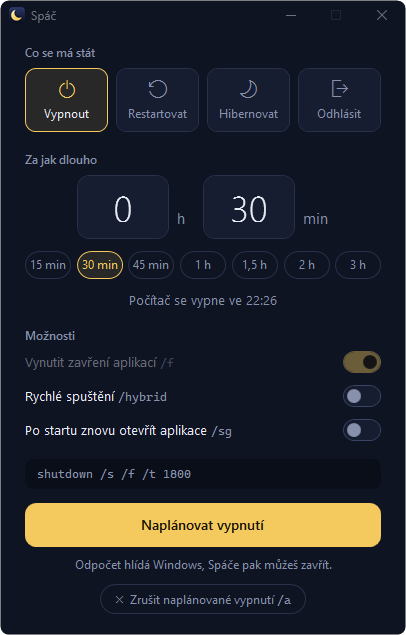
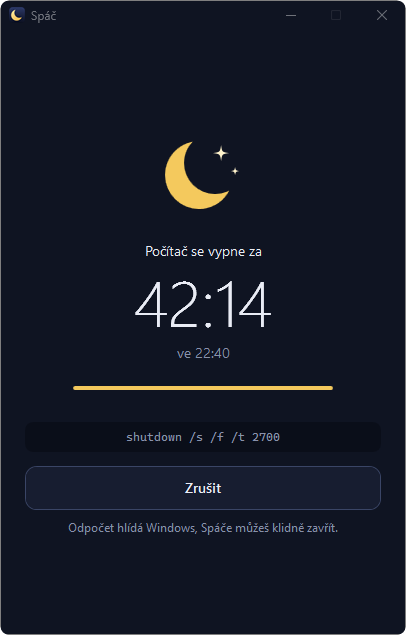

<p align="center">
  
</p>

<h1 align="center">Spáč</h1>

<p align="center">
  Malý časovač vypnutí pro Windows. Hezčí kabát pro <code>shutdown.exe</code>.
</p>

<p align="center">
  
  &nbsp;&nbsp;
  
</p>

Pustíš si film, nastavíš 1,5 hodiny a jdeš spát. Spáč zavolá `shutdown` se správnými přepínači a ukáže ti,
co přesně spouští.

- **Nic se neinstaluje ani nekompiluje.** Jeden skript v PowerShellu a jedno okno v XAML. Všechno, co
  potřebuje, už ve Windows je.
- **Čtyři akce:** vypnout, restartovat, hibernovat, odhlásit.
- **Čas na dvě kliknutí:** předvolby od 15 minut do 3 hodin, nebo vlastní hodnota až 23 h 59 min.
- **Vidíš, co se stane:** přesný příkaz i čas, kdy na něj dojde.
- **Jde to vzít zpět:** odpočet zrušíš i po zavření a znovuotevření aplikace. Tlačítko
  **Zrušit naplánované vypnutí** navíc zruší i to, co Spáč nenastavil.

## Instalace

```
git clone https://github.com/JohnyLeeJohnes/spac.git
```

Ve složce `spac` pak poklepej na **`install.cmd`**. V nabídce Start a na ploše se objeví zástupce **Spáč**
s ikonou a aplikace se spouští jako každá jiná, bez okna konzole.

- **Jen vyzkoušet:** poklepej na `Spac.cmd`, spustí Spáče bez vytváření zástupců.
- **Přesunutí složky:** zástupce ukazuje tam, kde Spáč leží. Po přesunutí spusť `install.cmd` znovu.
- **Odebrání:** smaž oba zástupce a složku. Nic dalšího Spáč v systému nenechává.

Potřebuješ Windows 10 nebo 11 (Windows PowerShell 5.1 je jejich součástí). Vyzkoušeno na Windows 11.

> **Stahuješ ZIP místo `git clone`?** Windows si soubory stažené z internetu označí a skripty s tímhle
> označením nemusí spustit. Před rozbalením proto klikni na ZIP pravým tlačítkem a zvol
> **Vlastnosti → Odblokovat**. Klonování přes git tohle označení nepřidává.

## Co který přepínač dělá

| V aplikaci | Příkaz | Poznámka |
| --- | --- | --- |
| Vypnout | `shutdown /s /t <sekundy>` | Výchozí akce. |
| Restartovat | `shutdown /r /t <sekundy>` | |
| Hibernovat | `shutdown /h` | Jen pokud je hibernace v systému zapnutá. |
| Odhlásit | `shutdown /l` | |
| Vynutit zavření aplikací | `/f` | Aplikace se zavřou bez ptaní, neuložená práce se ztratí. |
| Rychlé spuštění | `/hybrid` | Jen s `/s`. Hybridní vypnutí jako u položky Vypnout v nabídce Start. |
| Po startu znovu otevřít aplikace | `/sg` místo `/s`, `/g` místo `/r` | Windows po přihlášení obnoví aplikace, které to podporují. |
| Zrušit (u běžícího odpočtu) | `shutdown /a` | |
| Zrušit naplánované vypnutí | `shutdown /a` | Zruší jakékoli naplánované vypnutí nebo restart, i to z příkazové řádky. |

## Dobré vědět

- **Vypnutí a restart s odpočtem jsou vždy vynucené.** Jakmile je `/t` větší než nula, Windows si `/f`
  doplní samy. Přepínač je proto u těchto akcí zapnutý napevno. Než odejdeš, ulož si práci.
- **Vypnutí a restart hlídá Windows.** Spáče můžeš po naplánování zavřít. Když ho otevřeš znovu, ukáže
  běžící odpočet a nabídne zrušení.
- **Hibernaci a odhlášení hlídá Spáč.** `shutdown.exe` u `/h` a `/l` časovač neumí, takže odpočítává
  aplikace a příkaz spustí až na konci. Musí proto zůstat spuštěná, zavřením okna odpočet zrušíš.
- **`/hybrid` a `/sg` se vylučují.** `shutdown.exe` tu kombinaci odmítne, takže zapnutí jednoho přepínače
  vypne druhý.
- **Nové nastavení přepíše staré.** Pokud už nějaké vypnutí naplánované je (třeba z příkazové řádky),
  Spáč ho zruší a nastaví to svoje.
- **Režim spánku tu není.** `shutdown.exe` ho neumí a Spáč záměrně nedělá nic, co by nešlo napsat do
  příkazové řádky.
- **Proč skript, a ne `.exe`.** Nepodepsaný `.exe` umí Windows 11 (Smart App Control) zablokovat. Skript
  běží bez podpisu a před spuštěním si ho můžeš celý přečíst.

Naplánované vypnutí jde vždy zrušit i bez aplikace:

```
shutdown /a
```

Spáč si ukládá jediný soubor, `%LOCALAPPDATA%\Spac\pending`, a to jen po dobu běžícího odpočtu.

## Úpravy

| Soubor | Obsah |
| --- | --- |
| `Spac.ps1` | Chování: skládání přepínačů, volání `shutdown.exe`, odpočet, vytvoření zástupců. |
| `Spac.xaml` | Vzhled okna: barvy, styly, rozložení. |
| `Spac.cmd`, `install.cmd` | Spuštění bez instalace a vytvoření zástupců. |
| `tools/make-icon.ps1` | Vygeneruje ikonu do `assets/`. |
| `tests/e2e.ps1` | Test, který aplikaci proklikne přes UI Automation. |

Chceš jiné barvy? Celá paleta je na začátku `Spac.xaml`. Jiné předvolby času? Řádek s `Presets` tamtéž,
hodnota `Tag` je počet minut. Změny se projeví při dalším spuštění, nic se nesestavuje.

Test se pouští takhle:

```
powershell -ExecutionPolicy Bypass -File tests/e2e.ps1
```

Pozor, opravdu plánuje vypnutí (na hodiny dopředu) a hned ho ruší. Na konci vždy zavolá `shutdown /a`,
takže zruší i vypnutí, které sis naplánoval sám. Hibernaci ani odhlášení nikdy nespustí.

## Přispívání

Forkuj, upravuj, posílej pull requesty. Změny se zapisují do [CHANGELOG.md](CHANGELOG.md).

## Licence

[MIT](LICENSE)

---

**In English:** Spáč ("the sleeper") is a tiny shutdown timer for Windows 10/11, a friendly UI on top of
`shutdown.exe`. Pick an action (shut down, restart, hibernate, log off), pick a delay, and it runs the
matching command and shows you exactly which one. It is a PowerShell script with a WPF window: clone the
repo and run `install.cmd` to get a shortcut, nothing to compile or install. The interface is in Czech.
